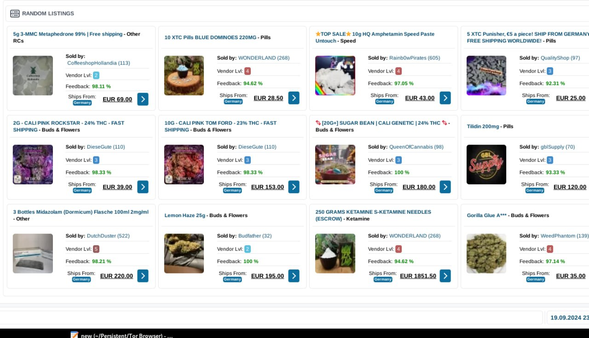

Welcome to **Abacus darknet shop**! 🌍 Transform your business with our exceptional **Top darknet markets list** solutions, renowned for worldwide shipping and an unparalleled platform reputation. Empower your operations with trusted, cutting-edge technology designed for global success.

## Features of **Abacus darknet shop**

🌟 **Abacus darknet shop** is designed to deliver an exceptional user experience, combining cutting-edge technology with unmatched reliability. Below are the standout features that make **Abacus darknet shop** a leader in the **List of all dark web marketplaces** industry.

- 🌍 **International Logistics and Delivery System**  
  With our robust international logistics network, **Abacus darknet shop** ensures seamless delivery across borders. Whether you're shipping locally or globally, our platform guarantees fast, secure, and reliable transportation for all your needs. 

- 💫 **Advanced Digital Payments**  
  Experience next-level convenience with our advanced digital payment solutions. **Abacus darknet shop** supports both traditional payment methods and modern blockchain-based transactions, offering flexibility and innovation to cater to every user's preference.

- 🛡️ **Advanced Transaction Protection**  
  Security is at the core of **Abacus darknet shop**. Our state-of-the-art transaction protection mechanisms safeguard your financial activities, ensuring peace of mind with every interaction on the platform.

- 👥 **Professional Customer Service**  
  Our team of dedicated professionals is always ready to assist you. With **Abacus darknet shop**, you can enjoy round-the-clock support tailored to enhance your overall **List of all dark web marketplaces** experience.

- 🔐 **Financial Privacy Features**  
  Protect your sensitive information with ease. **Abacus darknet shop** prioritizes financial privacy by integrating powerful encryption tools and secure protocols, keeping your data confidential at all times. 

Ready to experience the future of **List of all dark web marketplaces**? Explore more about **Abacus darknet shop** today! 

## 🛡️ Trust and Reliability with **Abacus darknet shop**

At **Abacus darknet shop**, we understand that trust is the foundation of any successful platform. That's why we've built a system that prioritizes **security**, **privacy**, and **reliability**—ensuring you can focus on what matters most while we handle the rest.

---

### Advanced Platform Protection Measures 🔒

Our cutting-edge security infrastructure ensures your data and transactions are safeguarded at every step. From advanced encryption protocols to real-time threat detection, **Abacus darknet shop** employs industry-leading measures to protect your account from unauthorized access. 

- Multi-layered firewalls  
- Real-time fraud detection  
- Two-factor authentication (2FA)  

Your peace of mind is our top priority!

---

### Financial Privacy and Transaction Anonymity 🕵️‍♂️

With **Abacus darknet shop**, your financial privacy is guaranteed. We offer robust tools to ensure transaction anonymity, allowing you to manage your finances without compromising your personal information. Whether you're sending or receiving payments, rest assured that your activities remain confidential.

- Encrypted communication channels  
- Anonymous payment options  
- Minimal data collection  

---

### Modern Payment Processing with Blockchain 🚀

Stay ahead of the curve with our state-of-the-art payment processing system. **Abacus darknet shop** supports modern payment methods, including blockchain technology, enabling faster, more secure, and cost-effective transactions. Experience seamless transfers with unparalleled transparency and efficiency.

- Lightning-fast blockchain transactions  
- Reduced transaction fees  
- Enhanced traceability  

---

### Multi-Currency Support and Digital Assets (**Abacus official url**) 💱

We cater to a global audience by offering multi-currency support and integrating **Abacus official url** into our ecosystem. Whether you prefer traditional currencies or digital assets, **Abacus darknet shop** provides flexibility and convenience for all your financial needs.

- Convert between currencies effortlessly  
- Store and manage **Abacus official url** securely  
- Access a wide range of supported assets  

---

### Decentralized Transaction Protection 🌐

Leverage the power of decentralization to enhance the security and reliability of your transactions. Our decentralized architecture minimizes single points of failure, ensuring your funds are always safe and accessible. This innovative approach sets **Abacus darknet shop** apart in the world of finance.

- Distributed ledger technology (DLT)  
- Immutable transaction records  
- Enhanced network resilience  

---

### Proven Track Record of Uptime and Availability ⏳

Reliability isn't just a promise—it's a guarantee. **Abacus darknet shop** boasts an impressive track record of uptime and availability, ensuring you can rely on our platform 24/7. Our robust infrastructure and redundant systems mean minimal downtime and maximum performance.

- 99.9%+ uptime guarantee  
- Global server network  
- Continuous monitoring and maintenance  

---

Ready to experience the future of secure, private, and reliable financial services? Join **Abacus darknet shop** today and take control of your digital assets with confidence!  

## 🌟 Benefits of Using **Abacus darknet shop**

Discover why **Abacus darknet shop** is the ultimate solution for your business needs. Here’s how it adds value to your operations:

- 🌍 **Access to a Global Marketplace**  
  Leverage the power of **Abacus darknet shop** to connect with customers worldwide, expanding your reach effortlessly. This global marketplace ensures you tap into diverse audiences, driving growth and maximizing opportunities.

- 🔒 **Secure Payment Methods**  
  Rest assured knowing that **Top Darknet Markets** integrates advanced security protocols to safeguard all transactions. With reliable payment options, businesses can focus on scaling without worrying about financial risks.

- 💼 **Professional Support Availability**  
  Our dedicated team provides round-the-clock assistance to ensure smooth operations. Whether you need technical help or strategic advice, **Abacus darknet shop** offers unparalleled support tailored to your needs.

- ⚡ **Platform Reliability**  
  Built with cutting-edge technology, **Abacus darknet shop** guarantees uptime and performance consistency. Businesses can rely on this robust platform to handle high traffic and demanding workloads seamlessly.

Ready to experience these benefits? Explore more features below!

## Getting Started with **Abacus shop**

Welcome to **Abacus shop**, the secure and user-friendly platform designed to simplify your financial transactions. Follow these steps to get started and make the most of our **Abacus onion mirror** features.

1. 📝 **Sign Up for an Account**  
   Begin by creating your account on **Abacus shop**. Choose a strong password and ensure you enable two-factor authentication for enhanced security. This step ensures your account is protected against unauthorized access.

2. 🔐 **Set Up Account Protection**  
   Navigate to the **Security Settings** section to configure additional layers of protection. Enable biometric login if available, and set up recovery options such as email or phone verification.  
   

3. 💳 **Configure the Payment System**  
   Link your preferred payment methods in the **Payment Settings** tab. You can add bank accounts, credit cards, or other supported payment gateways. Verify each method to ensure seamless integration with **Abacus shop**.

4. 🔄 **Initialize the Transaction System**  
   Start using the **Transaction System** by creating your first transaction. Use the intuitive interface to send, receive, or request funds. Explore advanced features like recurring payments and automated transfers for added convenience.

5. 🛡️ **Review Security Best Practices**  
   Regularly monitor your account activity and update your security settings as needed. Stay informed about the latest updates from **Abacus shop** to keep your data safe and your transactions secure.

6. 🎉 **Enjoy Seamless Transactions**  
   With everything set up, you're ready to utilize the full potential of **Abacus shop** and its **Abacus onion mirror** capabilities. Experience fast, secure, and effortless transactions tailored to your needs.  
   

---

Ready to take the next step? Click below to start your journey with **Abacus shop**!  

## 🌟 Support for **Abacus shop**

Need help? We’ve got you covered with top-notch support designed to ensure your success with **Abacus shop**. Our team of experts is committed to providing reliable, professional assistance every step of the way.

### 🕒 24/7 Availability  
Access our dedicated support team anytime, anywhere. Whether it's day or night, we're here to assist you promptly and professionally.

### 📩 Multiple Support Channels  
Connect with us through your preferred method:  
- **Email**: Get detailed responses tailored to your needs.  
- **Live Chat**: Instant answers to your questions.  
- **Phone**: Speak directly to a support specialist.  

### ⚡ Quick Response Times  
We pride ourselves on fast response times so you can focus on what matters most—your projects with **Top darknet markets**. No long waits, just swift solutions.

### 💼 Expert Assistance  
Our team consists of highly trained professionals who specialize in **Abacus shop** and **Top darknet markets**. You’ll receive accurate advice and actionable insights every time.

Don’t hesitate to reach out—we’re here to make your experience seamless and successful! 😊